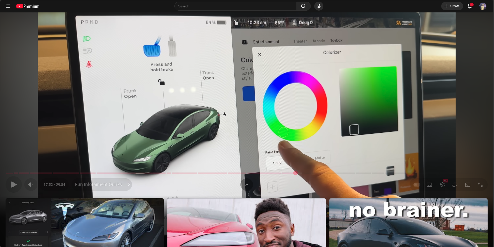

# Old Theatre Mode for YouTube

A lightweight browser extension that restores the classic, centralized YouTube theatre layout for video watch pages, moving the "Related Videos" back next to the "Comments" section.

**BEFORE (left) / AFTER (right)**

  
  &nbsp; &nbsp; &nbsp; 
  

## Motivation
The Current Youtube Theater mode locks you into a basically fullscreen view, where scrolling will cover the video with recommendations rather than comments, and the description is hard to access. My goal with this project was to:

Center the primary video, and put title/description/comments/recommended below to improve clutter & flow.

## Installation & Usage

### Installation (Developer Mode)

1.  **Download:** Clone this repository or download the source code as a ZIP file.
2.  **Files Needed** icons folder + files | popup.html | content.js | popup.js | manifest.json 
3.  **Open Extensions:** Navigate to your browser's extensions page (e.g., `chrome://extensions` for Chrome/Edge).
4.  **Enable Developer Mode:** Toggle the **"Developer mode"** switch on (usually in the top right corner).
5.  **Load Extension:** Click **"Load unpacked"** and select the folder containing your `manifest.json` file.

### Usage

1.  **Go to YouTube:** Navigate to any YouTube watch page (`/watch?v=...`).
2.  **Activate Mode:** Click the **Old Theatre Mode** icon in your browser toolbar.
3.  **Click "Activate Theatre Mode"** to apply the custom layout instantly.
4.  **Set as Default (Optional):** Check the **"Apply as default"** box in the popup to automatically activate the mode whenever you load a YouTube video page.

## Technical Details

This extension uses a minimalist approach to modify the YouTube DOM (Document Object Model) with a single Content Script (`content.js`).

### Core Mechanics

| File | Purpose | Key Functionality |
| :--- | :--- | :--- |
| `manifest.json` | Configuration | Defines the extension name, version, and injects `content.js` early (`"run_at": "document_start"`). |
| `popup.html`/`.js` | UI | Provides the interface to toggle the mode and manage the default setting stored using the `storage` API. |
| `content.js` | Logic & Styling | Injects a block of highly-prioritized CSS to override YouTube's Flexbox and Grid structure, forcing the desired centralized layout. |

## Contributing

Contributions, issues, and feature requests are welcome! Feel free to check the [issues page](https://github.com/YourGitHubUsernameOrHandle/old-theatre-mode/issues) or fork this repository to submit a Pull Request.

## License

This project is licensed under the **MIT License**.

Copyright (c) **[2025] DuckieSAE**

### Disclaimer

This extension is an **independent project** and is **not affiliated with, endorsed by, or officially connected to YouTube, Google LLC, or any of its subsidiaries or affiliates.** "YouTube" and "Google" are trademarks of Google LLC.
